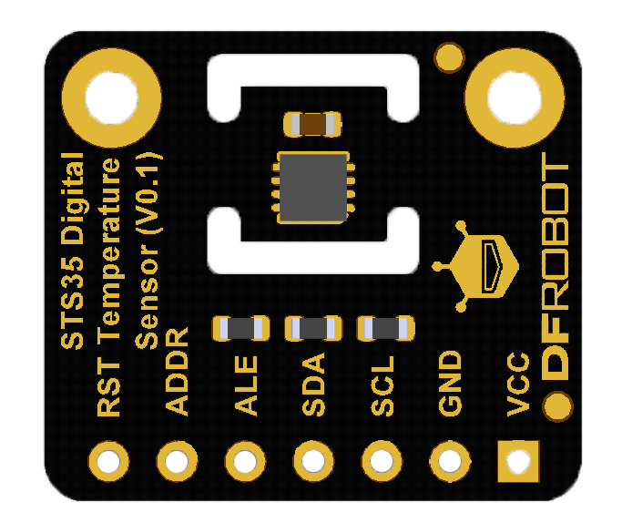

# DFRobot_STS3X
* [中文版](./README_CN.md)

High-Accuracy Digital Temperature Sensor IC
Fully calibrated and linearized digital output
Wide supply voltage range, from 2.15 V to 5.5 V
I2C Interface with communication speeds up to 1
MHz and two user selectable addresses
Accuracy of up to 0.1 °C
Very fast start-up and measurement time 
Tiny 8-pin DFN package
NIST traceability




## Product Link (https://www.dfrobot.com/)
    SKU：SEN0434


## Table of Contents

* [Summary](#summary)
* [Installation](#installation)
* [Methods](#methods)
* [Compatibility](#compatibility)
* [History](#history)
* [Credits](#credits)


## Summary

* Get the real-time temp
* Set measurement mode
* Get the sensor status


## Installation

Download the library file before use, paste it into the specified directory, then open the Examples folder and run the demo in the folder.


## Methods

```python

    '''
       @brief Init the sensor
    '''
    def begin(self)

    '''
       @brief Set repeat mode
       @n The repeatability setting influences the measurement duration and thus the overall energy consumption of the sensor.
       @param repeat, Repeat measurement config mode, there are three modes: REPEAT_HIGH, REPEAT_MEDIUM, REPEAT_LOW
    '''
    def set_repeat(self, repeat=REPEAT_LOW)

    '''
       @brief Set measurement frequency
       @param Data measurement frequency, default to be 1Hz, freq: FREQ_2S, FREQ_1HZ, FREQ_2HZ, FREQ_4HZ, FREQ_10HZ
    '''
    def set_freq(self,  freq=FREQ_1HZ)

    '''
       @brief Set the heater on
    '''
    def set_heater_on(self)

    '''
       @brief Set the heater off
    '''
    def set_heater_off(self)

    '''
       @brief Break the ongoing work of the sensor to wait the next command
    '''
    def sensor_break(self)

    '''
       @brief Reset the sensor
    '''
    def sensor_reset(self)

    '''
       @brief Get and save all the current status of sensor
       @n Every once in a while, you need to call the interface before using other api to get the current status of the sensor
    '''
    def get_sensor_status(self)

    '''
       @brief Get checksum status
       @return true: Writing checksum succeeds
       @n      false: Writing checksum error
    '''
    def check_sum_status(self)

    '''
       @brief Get command status
       @return true: The last command is implemented successfully.
       @n      false: The last command is unhandled.
    '''
    def command_status(self)

    '''
       @brief Detect whether the system is reset
       @return true: The reset is not detected since the command to clear status register is sent.
       @n      false: The reset is detected (hard and soft reset command or supply failed)
    '''
    def system_reset_detected(self)

    '''
       @brief Temp tracking alert
       @return true: No alert
       @n      false: There is an alert
    '''
    def temp_tracking_alert(self)

    '''
       @brief Get heater status
       @return true: The heater is off
       @n      false: The heater is on
    '''
    def heater_status(self)

    '''
       @brief Get alert pending status
       @return true: No pending alert
       @n      false: There is at least a pending alert
    '''
    def alert_pending_status(self)

    '''
       @brief Get the current temp under single measurement mode
       @return unit: ℃
    '''
    def get_temperature_single(self)

    '''
       @brief Get the current temp under period measurement mode
       @return unit: ℃
    '''
    def get_temperature_period(self)

```


## Compatibility

* RaspberryPi Version

| Board        | Work Well | Work Wrong | Untested | Remarks |
| ------------ | :-------: | :--------: | :------: | ------- |
| RaspberryPi2 |           |            |    √     |         |
| RaspberryPi3 |           |            |    √     |         |
| RaspberryPi4 |     √     |            |          |         |

* Python Version

| Python  | Work Well | Work Wrong | Untested | Remarks |
| ------- | :-------: | :--------: | :------: | ------- |
| Python2 |     √     |            |          |         |
| Python3 |     √     |            |          |         |


## History

- 2021/09/01 - Version 1.0.0 released.


## Credits

Written by qsjhyy(yihuan.huang@dfrobot.com), 2021. (Welcome to our [website](https://www.dfrobot.com/))
